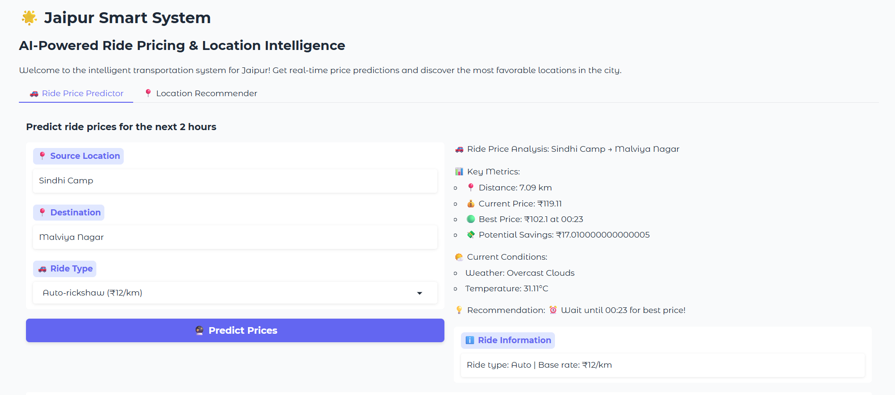

# Jaipur-Smart-System

Jaipur Smart System is an intelligent, data-driven platform designed to enhance transportation efficiency and urban decision-making in the city of Jaipur. It leverages real-time weather, location, and time-based inputs to provide two key services:

=>Ride Price Prediction:
  Uses dynamic surge pricing logic based on traffic trends, weather conditions, holidays, and time-of-day to forecast ride fares for various transport modes like auto-rickshaws, cabs, e-rickshaws, and bikes. Users     can compare prices over the next 2 hours and choose the most economical time to travel.

=>Location Recommender System:
  Predicts the most favorable locations in Jaipur to target for higher customer demand, especially useful for ride drivers and delivery partners. The system intelligently adapts to special events, festivals, and       weather to recommend top zones for increased earnings.

.png)

